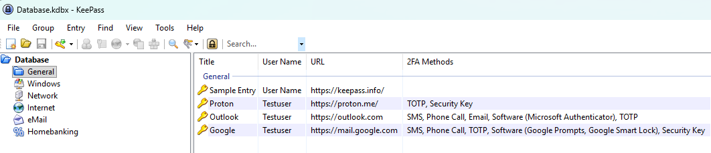
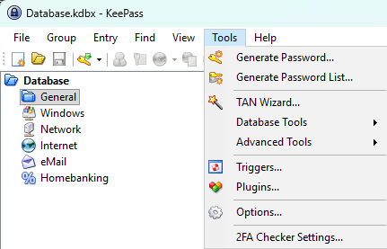
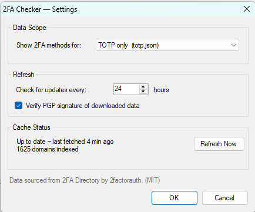

# KP2FAChecker

**A KeePass 2.x plugin that shows which two-factor methods your saved sites support.**


**KP2FAChecker** adds a **2FA Methods** column to your KeePass entry list. For each
entry it looks up the entry's domain in the [2FA Directory](https://2fa.directory/)
maintained by [2factorauth](https://2fa.directory/) and lists the two-factor-authentication
methods that site supports — e.g. `TOTP, Security Key, SMS`.



KP2FAChecker is **informational only**: it tells you which 2FA methods a website supports so you
know what you could enable. It does not generate or store any codes or credentials and never
modifies your entries — it only reads each entry's website address to look it up in the directory.

> **Not the same as "2FA Support".** A separate third-party plugin,
> [KP2faChecker](https://github.com/tiuub/KP2faChecker) by tiuub, adds a column titled
> **"2FA Support"**. To avoid two identical headers if you run both, this plugin's column is
> titled **"2FA Methods"**.

> **Status:** early prerelease (`0.1.0`). The methods column, settings dialog, signature
> verification and update check work today. Richer UI (entry context menu, search and detail
> views) is planned — see the roadmap below.

## Features

- **2FA Methods column** in the main entry list, listing the methods each site supports
  (blank when the site has no documented 2FA / is not in the directory).
- **Smart domain matching.** The lookup walks from the full host down to the registrable
  domain (eTLD+1, using the Public Suffix List), most-specific first.
- **Configurable scope.** Show any 2FA support, or only sites supporting a specific method
  (TOTP, security key / U2F, SMS, or email).
- **Offline-friendly caching.** The directory is fetched on a configurable interval and cached
  locally; if a refresh fails, the last known-good data keeps working.
- **PGP signature verification (on by default).** The downloaded directory is verified against
  2factorauth's pinned RSA‑4096 code‑signing key before it is used; you can opt out in settings.
- **Update check.** Integrates with KeePass's built-in plugin update check so you're notified
  when a new version is available.

## Installation

KP2FAChecker ships in two interchangeable formats — both are built from the same source and behave
identically, so pick whichever you prefer:

| Format | What it is | Choose it if… |
| --- | --- | --- |
| **`.plgx`** | Source package KeePass compiles on first load | You want the conventional KeePass plugin format |
| **`.dll`** | Precompiled, self-contained assembly (single file, no extra dependencies) | You'd rather skip the on-load compile step |

1. Download **either** `KP2FAChecker.plgx` **or** `KP2FAChecker.dll` from the
   [Releases](https://github.com/gusowski1/KP2FAChecker/releases) page.
2. Close KeePass.
3. Copy the file into your KeePass **`Plugins`** folder
   (next to `KeePass.exe`, e.g. `C:\Program Files\KeePass Password Safe 2\Plugins\`).
4. Start KeePass. Open **Tools → Plugins** to confirm *KP2FAChecker* is listed.

> Install only **one** of the two. The `.plgx` is compiled on first load, so allow a moment the
> first time; the `.dll` loads immediately.

## Usage

**Show the column:** right‑click the entry-list column header (or use **View → Configure
Columns…**) and enable **2FA Methods**.

**Open settings:** **Tools → 2FA Checker Settings…**



The first time it runs, KP2FAChecker downloads the directory in the background; the column fills in
once the data arrives.

### What the column shows

The cell lists the documented 2FA methods for the entry's domain, comma-separated:

| Token | Shown as |
| --- | --- |
| `totp` | **TOTP** |
| `u2f` | **Security Key** |
| `sms` | **SMS** |
| `email` | **Email** |
| `call` | **Phone Call** |
| `custom-software` | **Software** (with product names, e.g. *Software (Authy)*) |
| `custom-hardware` | **Hardware** (with product names, e.g. *Hardware (YubiKey)*) |
| *(none)* | *(blank — no documented 2FA, or the site isn't in the directory)* |

### Settings

| Setting | Description | Default |
| --- | --- | --- |
| **Data scope** | Show *any* 2FA support, or only *TOTP*, *security key / U2F*, *SMS*, or *email*. | Any |
| **Refresh interval** | How often (in hours) to check the directory for updates. | 24 |
| **Verify PGP signature** | Download and verify the signed data before using it (see below). | On |

The settings dialog also shows the cache status (last refresh, number of domains indexed) and
has a **Refresh Now** button.



## How it works

- **Data source.** The plugin fetches one of `all.json`, `totp.json`, `u2f.json`, `sms.json`, or
  `email.json` from `https://api.2fa.directory/v4/` depending on the configured scope, using
  conditional `If-None-Match` requests so unchanged data isn't re-downloaded. In `all.json`,
  disabled sites (empty `{}` objects) and entries with no documented methods are skipped.
- **Domain matching.** Hosts are reduced to candidate domains via the
  [Public Suffix List](https://publicsuffix.org/) and checked most-specific first.
- **Caching.** Content and metadata are cached under
  `%LocalAppData%\KeePassPluginCache\KP2FAChecker\`. Writes are atomic, and a failed refresh
  falls back to the cached copy.
- **Signature verification (on by default).** With *Verify PGP signature* enabled (the default),
  the plugin downloads the corresponding `.json.sig` — a compressed OpenPGP message that embeds the
  JSON and an RSA‑4096 / SHA‑512 signature — verifies it against 2factorauth's pinned signing key
  (fingerprint `0D504141…CBABC36D`, the same key the 2FA Directory uses elsewhere), and uses the
  embedded, verified JSON. Verification is fail‑closed: it never falls back to unverified data. No
  third-party crypto library is bundled; verification uses only the .NET BCL.
- **Update check.** KeePass periodically reads the plugin's `UpdateUrl` and compares it against
  the installed version. It only *notifies* you; it never downloads or installs anything
  automatically.

## Privacy

KP2FAChecker **sends none of your data** — no entries, URLs, passwords, search queries, or telemetry.
It only *downloads* the public 2FA directory; which entries your database holds and which sites you
look up **never leave your machine** — all domain matching happens locally against the cached
directory.

The only outbound traffic is plain HTTPS `GET` requests for public, non-personal data:

- `api.2fa.directory` — the 2FA directory (and its `.sig` when verification is on).
- `publicsuffix.org` — the Public Suffix List (cached for 7 days).
- `raw.githubusercontent.com` — the plugin's version file, only when KeePass checks for updates.

Those requests carry only a standard `User-Agent` and (for caching) an `If-None-Match` ETag —
nothing about you or your vault.

## Building from source

**Prerequisites**

- Windows with the .NET Framework 4.8 developer tooling.
- A copy of **`KeePass.exe`** — it is **not included in this repository** (and not on NuGet), so
  you must supply your own. The `KeePass.exe` from the **portable** KeePass 2.x release is enough —
  no KeePass installation is required. It is used for packaging and as a compile reference, but is
  never bundled into the output. Provide it in one of these ways:
  - place your `KeePass.exe` at `Libs\KeePass.exe` (the default location the build looks for), **or**
  - run `.\build.ps1 -KeePassExe "C:\path\to\KeePass.exe"` to point at an existing install, **or**
  - when building in Visual Studio, set the `KeePass` reference's `HintPath` to your copy.

**Build**

```powershell
.\build.ps1
```

This produces **both** shipping formats in `build\` (printing each one's size and SHA‑256):
`KP2FAChecker.plgx` (packaged with `KeePass.exe --plgx-create`, compiled by KeePass on load) and
`KP2FAChecker.dll` (the same sources compiled into a single self-contained assembly). To install,
copy **either one** into your KeePass `Plugins` folder and restart KeePass.

Target framework is .NET Framework 4.8; the UI is WinForms. The plugin is self-contained — all
shared code (reused verbatim from KPPasskeyChecker) is compiled into the plugin assembly.


## Data source & attribution

2FA data is provided by the **2FA Directory** maintained by **2factorauth**, with the data
licensed under the **MIT License**. Browse the same data at
**[2fa.directory](https://2fa.directory/)** (the plugin reads its API at `api.2fa.directory`).
The data is crowdsourced — report a missing or incorrect entry at
**[github.com/2factorauth/twofactorauth](https://github.com/2factorauth/twofactorauth)**.


## License

KP2FAChecker (the plugin **code**) is licensed under the **GNU General Public License v3.0** — see
[LICENSE](LICENSE).

The 2FA *data* is provided by the 2FA Directory and is separately licensed under the **MIT
License**, as noted above.

## Acknowledgements

KP2FAChecker is a sibling of **KPPasskeyChecker** (same author) and reuses its shared
infrastructure. The original idea was inspired by
[KP2faChecker](https://github.com/tiuub/KP2faChecker) by tiuub (licensed under Apache 2.0), which
also adds a two-factor-authentication support column to KeePass; this plugin lists the *methods*
each site supports.
